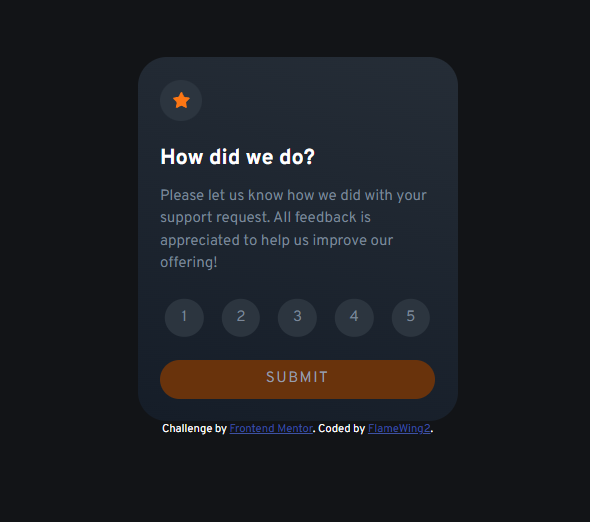

# Frontend Mentor - Interactive rating component solution

This is a solution to the [Interactive rating component challenge on Frontend Mentor](https://www.frontendmentor.io/challenges/interactive-rating-component-koxpeBUmI). Frontend Mentor challenges help you improve your coding skills by building realistic projects. 

## Table of contents

- [Overview](#overview)
  - [The challenge](#the-challenge)
  - [Screenshot](#screenshot)
  - [Links](#links)
- [My process](#my-process)
  - [Built with](#built-with)
  - [What I learned](#what-i-learned)
  - [Useful resources](#useful-resources)
- [Author](#author)

## Overview

### The challenge

Users should be able to:

- View the optimal layout for the app depending on their device's screen size
- See hover states for all interactive elements on the page
- Select and submit a number rating
- See the "Thank you" card state after submitting a rating

### Screenshot

### Links

- Solution URL: [Add solution URL here](https://your-solution-url.com)
- Live Site URL: [GitHub live page](https://flamewing2.github.io/interactive-rating-component/)

## My process

### Built with

- Semantic HTML5 markup
- CSS custom properties
- Flexbox
- Mobile-first workflow
- JavaScript

### What I learned

The things this project taught me are how to implement animations with CSS and how to manipulate the DOM using JavaScript. Adding or removing classes and using atributes to condition different functions is something I have never done before and I was worried about what kind of attributes we could use or remove without having a huge impact on the HTML. 

### Useful resources

- [Kevin Powell's youtube channel](https://www.youtube.com/@KevinPowell) - This helped me a lot about how to create animations in CSS and how to implement them.

## Author

- Frontend Mentor - [@FlameWing2](https://www.frontendmentor.io/profile/FlameWing2)
